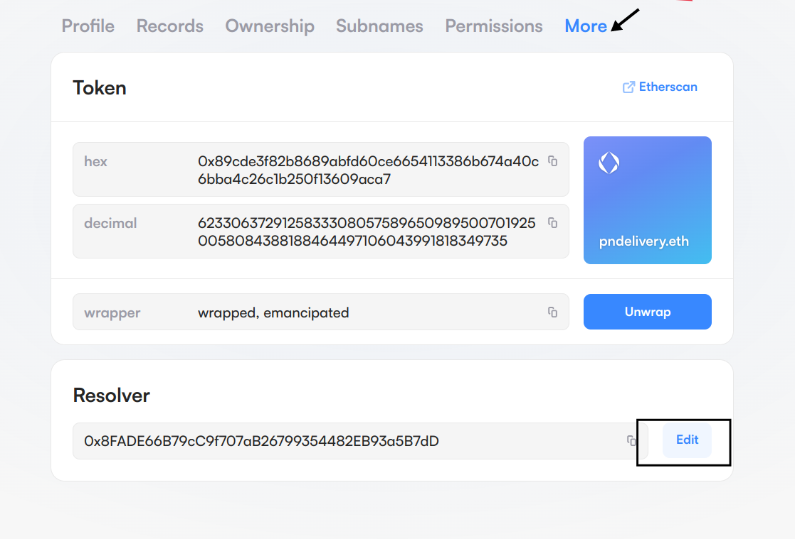

# Setting up the dm3 resolver locally

## Getting Started

This guide will walk you through the steps to set up the dm3 resolver locally. The resolver setup involves configuring environment variables, updating ENS domain records, and deploying the resolver using Docker.

## Step-by-step guide to set up a DM3 resolver service

Follow the steps below to set up your DM3 resolver service:

### Step 1: Prepare your directory

1. **Create a new directory:** Start by creating a new directory on your machine where you will store the resolver configuration files. For example, create a directory named `dm3-resolver`.

```bash
mkdir dm3-resolver-setup
cd dm3-resolver-setup
```

2. **Download the docker compose file:** Download the <mark style="color:blue;">docker-compose.yml</mark> file into this newly created directory. This file defines the services required to run the resolver.\

3. **Define `dm3-service-host` in `/etc/hosts/`:**  To add an entry in `/etc/hosts`, follow these steps:

*   **Open Terminal**

    On your local machine, open a terminal window. This can be done by searching for "Terminal" in your application launcher.
*   **Edit `/etc/hosts` File**

    Use a text editor to open the `/etc/hosts` file. You'll need superuser (root) privileges to edit this file. You can use `nano`, `vim`, or another text editor of your choice.\


    For example, using `nano`, type:\


    ```bash
     sudo nano /etc/hosts
    ```

    \
    You will be prompted to enter your password.\

*   **Add the Hostname Entry**

    Scroll to the bottom of the file or find a suitable place to add your new entry. Add a line with the IP address and the hostname. \
    \
    For example:

    ```bash
    127.0.0.1 dm3-service-host
    ```

    \
    This line maps the hostname `dm3-service-host` to the local  IP address `127.0.0.1`.
* **Save and Exit**

### Step 2: Create the `.env` file

Next, create a `.env` file in the same directory (`dm3-resolver`). This file will contain the environment variables needed to configure the resolver service.

1. **Create the `.env` file:** In the `dm3-resolver` directory, create a `.env` file&#x20;

```bash
touch .env
```

2. **Copy the below content and paste it into the .env file:**

```bash
SIGNER_PRIVATE_KEY=<your_signer_private_key>
RESOLVER_SUPPORTED_ADDR_ENS_SUBDOMAINS=<'["your_delivery_domain_name"]'>
RESOLVER_SUPPORTED_NAME_ENS_SUBDOMAINS=<'["your_delivery_domain_name"]'>
RESOLVER_ADDRESS=<your_resolver_contract_address>
RPC=<your_rpc_url>
```

Replace the placeholder values with your actual keys and URLs:

* **SIGNER\_PRIVATE\_KEY:** Replace `your_signer_private_key` with your Ethereum account’s private key that will be used to sign transactions.
* **RESOLVER\_SUPPORTED\_ADDR\_ENS\_SUBDOMAINS:** Replace `["your_delivery_domain_name"]` with the subdomain of your ENS domain for address resolution.
* **RESOLVER\_SUPPORTED\_NAME\_ENS\_SUBDOMAINS:** Replace `["your_delivery_domain_name"]` with the subdomain of your ENS domain for name resolution.
* **RESOLVER\_ADDRESS:** Replace `your_resolver_contract_address` with the contract address of your resolver.
* **RPC:** Replace `your_rpc_url` with the URL for your Ethereum RPC provider (e.g., Infura or Alchemy).

### Step 3: **Deploy the signature CCIP verifier contract**

1. **Clone the repository:** Clone the repository to your machine:

```bash
git clone https://github.com/dm3-org/Ccip-Resolver.git
```

2. **Navigate to the `Ccip-Resolver` directory:**

```bash
cd Ccip-Resolver
```

3. **Install Dependencies**

```bash
yarn install
```

4. **Create the `.env` file:** In the `Ccip-Resolver` directory, create a `.env` file&#x20;

```bash
touch .env
```

5. **Copy the below content and paste it into the .env file:**

```bash
SEPOLIA_RPC_URL="<your_seplia_rpc_url>"
DEPLOYER_PRIVATE_KEY="<your_deployer_private_key>"
ETHERSCAN_API_KEY="<your_etherscan_api_key>"
```

Replace the placeholder values with your actual keys and URLs

6. **Update the Deployment Script**:
   * Navigate to the `/deploy/04_SignatureCcipVerifier.ts` file in the repository.
   * **Update the `RESOLVER_CHAINID`**: Set `RESOLVER_CHAINID` to match the chain ID of the network you want to deploy to.
   * **Set the `CCIP_RESOLVER_ADDRESS`**:



```bash
CCIP_RESOLVER_ADDRESS = "0x88c8cC822095cdE6F92c8d20311C8e7dE6A98694";
```



```bash
CCIP_RESOLVER_ADDRESS = "0x88c8cC822095cdE6F92c8d20311C8e7dE6A9869
```



7. **Deploy the Contract**

Run the following command to deploy the contract:

```bash
npx hardhat run ./deploy/04_SignatureCcipVerifier.ts --network <network_name>
```

Replace `<network_name>` with the desired network where you want to deploy the contract (e.g., `sepolia`, `goerli`, etc.).

### Step 4: Update the resolver in the ENS domain

To ensure that your resolver is correctly set up, you need to update the resolver address in your ENS domain settings.

1. **Go to the ENS manager:** Visit the [ENS Manager](https://app.ens.domains/) and log in with the Ethereum account that controls your domain.
2. **Select your ENS domain:** Choose the ENS domain where you want to update the resolver.
3. **Update the resolver address:**

<figure><figcaption></figcaption></figure>

* After selecting your domain, click on **"More"** to access additional options.
* Select  **"Edit"**
* Enter the resolver address in the provided field.
* Confirm the changes and update them.

### Step 4: Set the verifier for the domain

To complete the resolver setup, you need to interact with the resolver contract to set the verifier for your domain.

1. **Access the resolver contract:** Visit the resolver contract on Etherscan or using your preferred Ethereum interface.
2.  **Execute the `setVerifierForDomain` method:**

    * **Node:** Provide the node value. You can get this value from your ENS record:
      * Go to the [ENS Manager](https://app.ens.domains) and select your domain.
      * Click on **"More"** to access additional options.
      * In the **"Token"** section, you will see the hexadecimal value. This is the value you need to use as the node in the `setVerifierForDomain` method.
    *   **URL:** Provide the URL of your resolver service. This should be the URL where your resolver service is accessible.&#x20;

        The format of the URL should be:

        ```bash
        <your_ccip_resolver_url>/{sender}/{data}.json
        ```

    If you are running your resolver service locally, you should use the `dm3-service-host` instead of `localhost`. This ensures that the resolver service is accessible both locally and within Docker containers. The `dm3-service-host` is set up to point to the localhost. For local testing, your URL should look like\


    ```bash
    http://dm3-service-host:8181/{sender}/{data}.json
    ```

    \
    We have configured `dm3-service-host` in the earlier steps to resolve correctly in both local and Docker contexts

    * **Address:** Provide the address of the signature CCIP verifier contract.
3. **Confirm the transaction:** Once you've entered the required details, confirm and execute the transaction. This will set the verifier for your domain in the resolver contract.

### Step 5: Use the resolver URL in your frontend application

Update the `.env` file in your frontend application&#x20;

<pre class="language-bash"><code class="lang-bash"><strong>REACT_APP_ADDR_ENS_SUBDOMAIN=&#x3C;your_resolver_service_ens>
</strong>REACT_APP_RESOLVER_BACKEND=&#x3C;your_resolver_backend_url>
REACT_APP_USER_ENS_SUBDOMAIN=&#x3C;your_resolver_service_ens>
</code></pre>

Replace the placeholder values with your actual keys and URLs.
