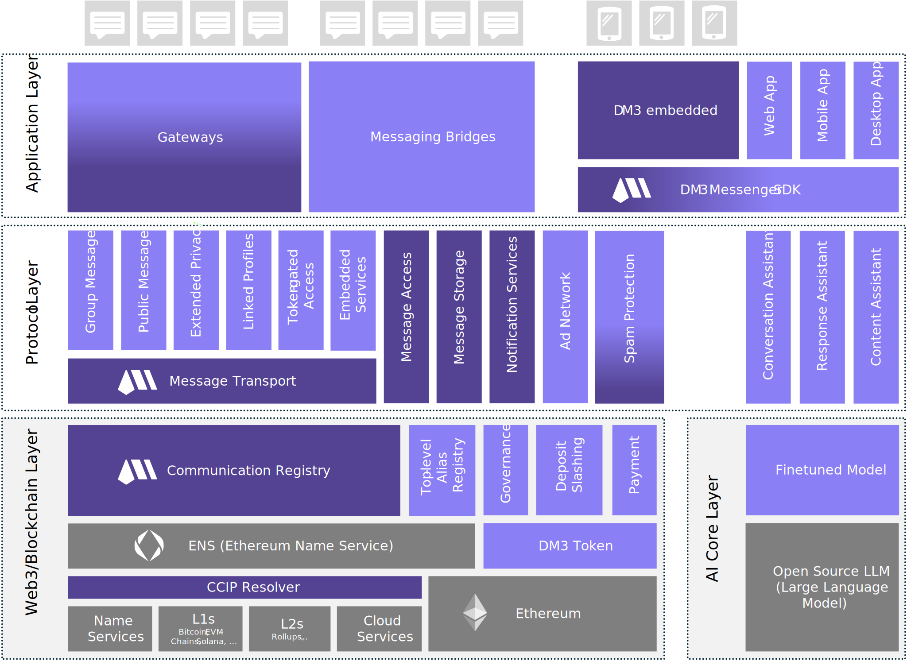

# Architecture

The DM3 protocol is structured in several layers. Its strictly modular architecture allows the required parts of the protocol, including libraries and APIs, to be precisely tailored to the use case.

There are five Categories:

1. **Blockchain Layer:** This layer defines all interface APIs to other data sources (other chains, layer-2, cloud services, etc.) besides ENS (Ethereum Name Service), which is based on Ethereum.
2. **AI Core Layer:** This Layer defines the AI core algorithms and models needed to build DM3's AI assistants.
3. **Protocol Layer:** The center of the protocol is the DM3 Message Transport Protocol. Many optional and utility extensions exist on top of the core protocol.
4. **Application Layer:** The application layer includes the APIs for integration into other protocols, services, and apps and the embedded UI components for direct integration into other applications.
5. **Utility Extensions:** Modules that are useful for building user-friendly messaging applications but not directly linked to the core protocol.

<figure><picture><source srcset="../../../.gitbook/assets/architecture_new_bk.svg" media="(prefers-color-scheme: dark)"></picture><figcaption>
DM3 Architecture - Overview
</figcaption></figure>
