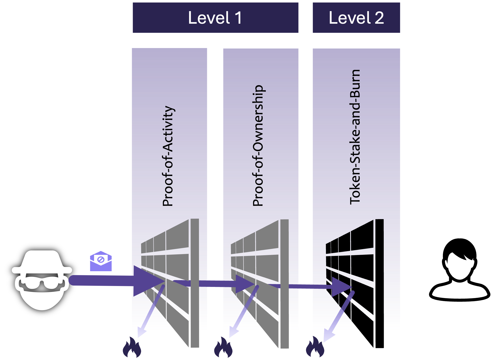

# Spam Protection

## Spam Protection

Spam is a major challenge in current communication systems. According to a survey [\[7\]](https://www.scmagazine.com/news/90-per-cent-of-email-is-spam-claims-new-survey), between 50% and well over 90% of all emails sent are classified as spam. However, spam and the fight against it are also important in larger messenger services.

Centralized systems generally find it somewhat easier to take action against spam, as they can censor more easily via their central infrastructure than in decentralized infrastructures (such as email).&#x20;

All widely used approaches to curbing spam are based on blocking messages suspected of being spam or blocking sender addresses. With Web3-based methods, however, it is possible to go further and make sending spam so unattractive for the sender that the motivation to send spam is no longer there. The DM3 protocol uses a Web3-based, multi-level spam defense system that works together to make spam unprofitable for the sender without significantly hindering the desired communication.

<figure><picture><source srcset="../../.gitbook/assets/spam_dark.png" media="(prefers-color-scheme: dark)"></picture><figcaption>
Multi-level web3 spam protection
</figcaption></figure>

### **Black- and Whitelists**

**Blacklists** are a common method of filtering messages from proven malicious senders. In terms of Web3-based communication, this means that addresses that have become conspicuous are included in such lists and can then be filtered out. This makes it possible to use public lists of known scammers and spammers for pre-filtering. As all messages in DM3 are signed by the sender, spammers can't use the identity of others to send messages.&#x20;

This method should be combined, as it cannot provide reliable protection against spam. However, blacklists in Web3 are only effective to a limited extent, as a spammer can easily keep generating new addresses that are not yet on the blacklist with almost no effort. Blacklists are mainly used to evaluate public lists (e.g., on which sanctioned users are noted).

**Whitelists** are suitable for giving preferential treatment to addresses that the user trusts. This makes it easy to exclude addresses on such a list from the check of further criteria described in the following paragraphs.

The message relay node can already execute these methods, so potential spam is not even accepted.

### **Proof-of-Activity**

If the sender's address has a nonce greater than 1 (or a number > 1 specified by the recipient), it is regarded as proof of activity. This ensures that this address has been active and transactions have been sent. This is usually not a problem for an active wallet with a "normal" wallet address.

However, if spammers try to send spam from newly generated addresses, they would have to execute one or even more transactions before using these addresses to send spam. This costs money (transaction fees) and time (until the transaction is added to the blockchain). It massively limits the number of possible new usable addresses. While a spammer could create an unlimited number of new addresses, the number of "used" addresses depends on the blockchain's capacity, as at least one transaction would have to originate from each address.

This method is well suited to preventing spam attacks, in which spammers constantly generate new addresses to circumvent block lists.&#x20;

The message relay node can already execute this method, so potential spam is not even accepted.

### **Proof-of-Ownership**

Another way to make sending spam unattractive is to require the sender to hold a certain number of tokens or an NFT from a certain collection on their wallet. This also prevents newly generated addresses from being used to send spam, as the spammer would have to equip all these addresses with these tokens.

This is not a relevant challenge for regularly used wallets. To send a message to a recipient who requires this condition, the required tokens must be transferred to the wallet once. However, possession of exotic tokens or very large amounts should not be required, as this may be a barrier to use.

This also results in high costs and expenses for the potential spammer, as he must equip each new address with tokens before it can be used for sending.&#x20;

This method can already be executed by the message relay node, so potential spam is not even accepted.

### **Token Stake and Burn**

While the methods already listed serve to limit mass spam in particular, a next level of spam protection is being introduced.

Each recipient can define how many DM3 tokens a sender has to deposit as security to guarantee that the message is not spam or scam. For a sender to be able to submit a message to the recipient's message relay node, he must have deposited at least the required amount. Only then will the message relay accept the message.&#x20;

If the recipient declares the message as spam, a part of the deposit is burned, and the spam sender is penalized. In this way, the spam sender can be penalized at any cost, so sending spam is no longer profitable.&#x20;

If the message is accepted, the deposit will not be affected. This means that nothing happens in regular conversations, and the sender does not have to fear any loss.&#x20;

The message relay can directly check whether the sender has made a sufficiently high deposit. Executing the punishment for spam requires interaction with the receiving client.
